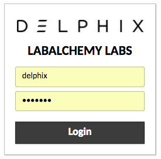
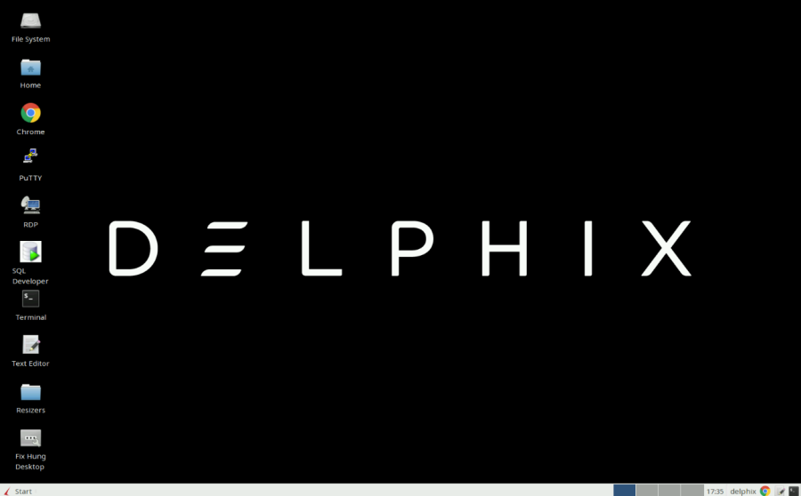

# Getting Started

#### Table of Contents
1. [Welcome to the Lab Guide](#welcome)
2. [Lab Requirements](#requirements)
3. [The Delphix Admin Training Cloud Lab](#traininglab)
4. [Important IP addresses for Oracle labs](#oracleipaddresses)
5. [Cloud lab usernames and passwords for Oracle labs](#oraclecreds)
6. [Important IP addresses for MS SQL labs](#mssqlipaddresses)
7. [Cloud lab usernames and passwords for MS SQL labs](#mssqlcreds)
8. [The RDP Client](#rdpclient)
9. [Contribute](#contribute)
    *   [Code of conduct](#code-of-conduct)
    *   [Community Guidelines](#community-guidelines)
    *   [Contributor Agreement](#contributor-agreement)
10.  [Reporting Issues](#reporting-issues)
11.  [Statement of Support](#statement-of-support)
12.  [License](#license)

## Hands-On Lab Guides
 * [Oracle](/oracle-admin/INSTRUCTIONS.md)
 * [MS SQL Server](/mssql-admin/INSTRUCTIONS.md)
 * [Self-Service](/self-service/INSTRUCTIONS.md)
 * [Postgres](/postgresql/instructions.md)
 * [Masking ](/masking/INSTRUCTIONS.md)
 * [ASE](/ase-admin/INSTRUCTIONS.md)

## Welcome to the Lab Guide

This guide is aimed at users or students participating in a Delphix hands-on lab.
It supplement to the Delphix Admin Training courses,
and provides several exercises to perform throughout the class. If you
encounter any issues during the exercises, please do not hesitate to ask your
instructor for advice.

## Lab Requirements

In order to perform these lab exercises, you will need:

  * A modern HTML5 capable web browser (IE10+, Chrome, Firefox, Safari)

## The Delphix Admin Training Cloud Lab

Your instructor should have provided you with a **Class Name** and a **Student
Number**. In order access your lab server, point your web browser to: http://
**classname**.agile.today/ **studentnumber**
For example, if your **Class Name** is  "acmetech" and your **Student Number**
is 5, you would go to the site: http://acmetech.agile.today/5

The Delphix Labs Login Dialog

At the login screen, enter the username and password: delphix/delphix
Once you have logged in, you will be connected to your lab server. This server
contains everything you will need to perform your lab exercises including:

  * RDP Client (Remmina) to connect to Windows Source and Target servers
  * Terminal and PuTTY to connect to Linux Source and Target servers
  * Chrome Web Browser
  * Notepad for class notes
  *	Oracle SQL Developer for remote connections to Oracle Databases
  * Lab Guides folder on the Desktop containing any exercises for this course, including this guide.

**IMPORTANT NOTE:** Do not use the  "Log Out" function on your lab server. If
you do, it will break your lab connection.

The Delphix Lab Server

### Important IP addresses for Oracle labs

In the IP addresses below, the "x" denotes your **Student Number**. For
example, if your student number is  "5," your Delphix Engine will be located at "10.0.5.10".

**NOTE: Please record your student number and IP addresses, as using another student's number will cause problems during the exercises**

Server  | IP Address
------- | -----------
Delphix Engine | 10.0.x.10
Linux Source | 10.0.x.20
Linux Target| 10.0.x.30

### Cloud lab usernames and passwords for Oracle labs

Server | Username | Default Password
------ | -- | ----------
Delphix Engine | (Sysadmin) sysadmin | sysadmin
Delphix Engine | (Delphix Admin) delphix_admin | delphix
Linux Source | delphix |delphix
Linux Target | delphix |delphix

### Important IP addresses for MS SQL labs

Server  | IP Address
------- | -----------
Delphix Engine | 10.0.x.10
Windows Source | 10.0.x.50
Windows Target| 10.0.x.60

### Cloud lab usernames and passwords for MS SQL labs

Server | Username | Default Password
------ | -------- | ----------
Delphix Engine | (Sysadmin) sysadmin | sysadmin
Delphix Engine | (Delphix Admin) delphix_admin | delphix
Windows Source Domain |  delphix\delphix_src |delphix
Windows Source MS SQL Admin|  sa |delphix
Windows Target Domain | delphix\delphix_trgt |delphix

## The RDP Client

Your lab server contains an RDP client that is pre-populated with the
Windows Source and Target servers. When you connect to a Windows system, the
screen will be larger than your Student Desktop. You can use the toolbar at
the top of the RDP client to switch to Full Screen mode. When you wish to
leave Full Screen mode, you can hover your mouse over the top of the Windows
screen until the RDP menu drops down, and toggle off Full Screen.

## Links

Include useful links to references or more advanced guides.
*   [GitHub Markdown Basics](https://help.github.com/articles/basic-writing-and-formatting-syntax/)
*   [GitHub Mastering Markdown](https://guides.github.com/features/mastering-markdown/)
*   [How to Write a Great Readme](https://dbader.org/blog/write-a-great-readme-for-your-github-project)
*   [Beginners Guide to Writing a Readme](https://medium.com/@meakaakka/a-beginners-guide-to-writing-a-kickass-readme-7ac01da88ab3)

## Contribute

1.  Fork the project.
2.  Make your bug fix or new feature.
3.  Add tests for your code.
4.  Send a pull request.

Contributions must be signed as `User Name <user@email.com>`. Make sure to [set up Git with user name and email address](https://git-scm.com/book/en/v2/Getting-Started-First-Time-Git-Setup). Bug fixes should branch from the current stable branch. New features should be based on the `master` branch.

#### Code of Conduct

This project operates under the [Delphix Code of Conduct](https://delphix.github.io/code-of-conduct.html). By participating in this project you agree to abide by its terms.

#### Contributor Agreement

All contributors are required to sign the Delphix Contributor agreement prior to contributing code to an open source repository. This process is handled automatically by [cla-assistant](https://cla-assistant.io/). Simply open a pull request and a bot will automatically check to see if you have signed the latest agreement. If not, you will be prompted to do so as part of the pull request process.

## Reporting Issues

Issues should be reported in the GitHub repo's issue tab. Include a link to it.

## Statement of Support

This software is provided as-is, without warranty of any kind or commercial support through Delphix. See the associated license for additional details. Questions, issues, feature requests, and contributions should be directed to the community as outlined in the [Delphix Community Guidelines](https://delphix.github.io/community-guidelines.html).

## License

This is code is licensed under the Apache License 2.0. Full license is available [here](./LICENSE).
