# Delphix Admin Training for Oracle Virtualization

## LAB GUIDE

## Table of Contents

**[Background](#_background)**

**[Getting Started](#_gettingStarted)**

* [Welcome to the Delphix Admin Training for Oracle Lab Guide](#_welcome)

* [Lab Requirements](#_reqs)

* [The Delphix Admin Training Cloud Lab](#_cloudLab)

* [Important IP Addresses](#_IPs)

* [Cloud Lab Usernames and Passwords](#_usrs)

* [Paths](#_paths)

**[Lab Exercises](#_exs)**

* [Exercise 1 – Logging into the Delphix Engine UI](#_ex1)

* [Exercise 2 – Create the &quot;delphix\_db&quot; User](#_ex2)

* [Exercise 3 – Validate the Source and Target Environment with Hostchecker](#_ex3)

* [Exercise 4 – Add a Source Environment](#_ex4)

* [Exercise 5 – Link a dSource](#_ex5)

* [Exercise 6 – Add Target Environments](#_ex6)

* [Exercise 7 – Provision a VDB](#_ex7)

* [Exercise 8 – Refresh a VDB](#_ex8)

* [Exercise 9 – Rewind a VDB](#_ex9)

* [Exercise 10 – Set a New Retention Policy](#_ex10)

* [Exercise 11 – Create and Save a Hook Operation Template](#_ex11)

* [Exercise 12 – Create a VDB Template](#_ex12)

* [Exercise 13 – Provision a VDB with Hook and VDB Template](#_ex13)

* [Optional Advanced Exercise – Discover and Link a 12c Container Database dSource](#_ex14)

* [Optional Advanced Exercise – Provision a Virtual PDB (vPDB)](#_ex15)

* [Optional Advanced Exercise – Measure Network Performance Test through the CLI](#_ex16)

* [Optional Advanced Exercise – Configure Delphix Replication](#_ex17)

# <a id="_background"></a>Background

This guide will get you started with Delphix&#39;s virtualization for Oracle. You will learn how to to securely copy and share datasets. Using virtualization, you will ingest data from sources and create virtual copies, which are full read-write capable database instances that use a small fraction of the resources a normal database copy would require.

Delphix Virtualization's functionality is exposed through two interfaces: management/admin and self-service. Through the management/admin interface (the topic of this guide), DB administrators connect to source datasets and create resources such as virtual databases. Through the self-service interface, non-admin users can operate on data provided by administrators. A guide for self-service can be found <a href="https://github.com/delphix/lab-guides/blob/master/self-service/INSTRUCTIONS.md">here</a>.

We also provide a guide for Delphix <a href="https://github.com/delphix/lab-guides/blob/master/masking/INSTRUCTIONS.md">masking</a>, and for other virtualization data sources such as <a href="https://github.com/delphix/lab-guides/blob/master/mssql-admin/INSTRUCTIONS.md"> MS SQL </a> and <a href="https://github.com/robertodelphix/lab-guides/blob/master/postgresql/instructions.md"> postgresql</a>.

# <a id="_gettingStarted"></a>Getting Started

## <a id="_welcome"></a>Welcome to the Delphix Admin Training for Oracle Lab Guide

This guide is a supplement to the Delphix Admin Training for Oracle course, and provides several exercises to perform throughout the class. If you encounter any issues during the exercises, please do not hesitate to ask your instructor for advice.

## <a id="_reqs"></a>Lab Requirements

In order to perform these lab exercises, you will need:

- A modern HTML5 capable web browser (IE9+, Chrome, Firefox, Safari)

## <a id="_cloudLab"></a>The Delphix Admin Training Cloud Lab

Your instructor should have provided you with a **Class Name** and a **Student Number**. In order to access your lab server, point your web browser to: http:// **classname**.agile.today/ **studentnumber**

For example, if your **Class Name** is &quot;acmetech&quot; and your **Student Number** is **5** , you would go to the site: [http://acmetech.agile.today/5](http://acmetech.agile.today/5)

   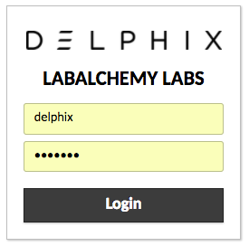

At the login screen, enter the username and password: delphix/delphix

Once you have logged in, you will be connected to your lab server. This server contains everything you will need to perform your lab exercises including:

- Terminal with SSH (or Putty) to connect to Linux source/target database servers
- Chrome Web Browser to connect to your Delphix Data Platform
- A copy of this lab guide
- Notepad for class notes
- Oracle SQL Developer for remote connections

**IMPORTANT NOTE:** Do not use the &quot;Log Out&quot; function on your lab server. If you do, it will break your lab connection.

   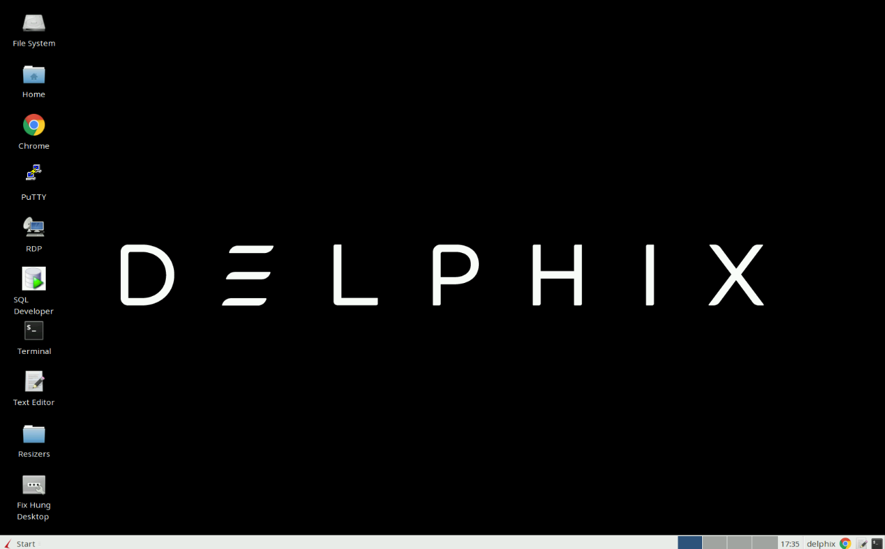

## <a id="_IPs"></a>Important IP Addresses

| Host | IP |  
| :--- | :--- |
| **Delphix Data Platform** | 10.0.x.10 |
| **Linux Source** | 10.0.x.20 |
| **Linux Target** | 10.0.x.30 |

In the above IP addresses, the **x** denotes your **Student Number**. For example, if your student number is **5** , your Delphix Data Platform will be located at 10.0. **5**.10.

## <a id="_usrs"></a>Cloud Lab Usernames and Passwords

| User | Password |
| :--- | :--- |
| Initial Delphix **sysadmin** | sysadmin |
| Initial Delphix **admin** | delphix |
| Source and Target **delphix** user (via SSH) | delphix |
| Source and Target **oracle** user (via SSH) | delphix |

## <a id="_paths"></a>Paths

| Object/Tool | Path |
| :--- | :--- |
| **hostchecker** (after tar extraction) | /home/delphix/hostchecker |
| **Oracle XE 11g** ORACLE\_HOME | /u01/app/oracle/product/11.2.0/xe |
| **Toolkit** | /u01/app/toolkit |


# <a id="_exs"></a>Lab Exercises

Perform these exercises when instructed by your Delphix Instructor.

<br></br>
## <a id="_ex1"></a>Exercise 1 – Logging into the Delphix Engine UI

In this exercise, you will:

- Access the Delphix Data Platform GUI as the Delphix admin user
- Access the Delphix Data Platform Setup GUI as the sysadmin user

**Context**

The Delphix virtualization GUI has two layers: management and setup. The management GUI is accessed by admins who control data assets and objects. The setup GUI is controlled by sysadmins who manage the engine and create new admin users.

Alternatively, the engine can be controlled through the [CLI](https://docs.delphix.com/docs/developer-s-guide/command-line-interface-guide/command-line-interface-overview) or [APIs](https://docs.delphix.com/docs/developer-s-guide/web-services-api-guide).

**Steps**

1. Connect to your Delphix Engine using Chrome on your lab server (see the **Important IP Addresses** section of the Getting Started guide above). The IP address will be 10.0.x.10, where &quot;x&quot; is your **Student Number**
2. Login to the Delphix Dynamic Data Platform using the username ***admin*** and password ***delphix***
3. Click **Log In**

   

4. In order to become more familiar with what is available here, browse around the various sections of the landing page.
5. Click **admin** on the upper right side and **logout**
6. Click **Setup** (Located under **Password)** to navigate to **Delphix Setup** login
7. Login to **Delphix Setup** using the username ***sysadmin*** and password ***sysadmin***
8. Click **Log In**

   

9. In order to become more familiar with what is available here, browse around the various sections of the landing page.

**Related Links**

[The admin and sysadmin User Roles](https://docs.delphix.com/docs/configuration/user-and-authentication-management/users-and-groups)

[Setting Up the Delphix Data Platform](https://docs.delphix.com/docs/deployment/installation-and-initial-system-configurations/initial-setup)

<br></br>
## <a id="_ex2"></a>Exercise 2 – Create the &quot;delphix\_db&quot; User

In this exercise, you will:

- Create a Delphix DB User on your source database

**Context**

Delphix requires access to database users with certain privileges. These are configured through automated scripts.

**Steps**

1. Use the **Terminal** app on your Jumpbox desktop to connect into your Linux Source (see the **Important IP Addresses** section of the Getting Started guide above).
   - Type ssh 10.0.x.20 (where &quot;x&quot; is your **Student Number)**
2. Extract the **hostchecker\_linux\_x86.tar** file in your home directory
   - Type ls -ltr
   - Type tar -xvf hostchecker\_linux\_x86.tar
3. Navigate to the hostchecker directory
   - Type cd hostchecker
   - Type ls -ltr (observe the files present in this folder, as we will be using them again)
4. Set the Oracle environment variables below:
   - Type export ORACLE\_HOME=/u01/app/oracle/product/11.2.0/dbhome\_1
   - Type export ORACLE\_SID=orcl
   - Note: &quot;. oraenv&quot; can be used to set the environment variable rather than export commands
5. Run the script to create the delphix\_db user
   - Type ./createDelphixDBUser.sh
6. Use the following details during the running of this script:
   - The user will be created in the default instance **orcl**. This is set by the environment variable ORACLE\_SID. Press **Enter** to accept the default database instance **orcl**
   - Delphix DB User Username:delphix\_db
   - Delphix DB User Password: delphix\_db
   - Decline the SELECT ANY DICTIONARY privilege. This is a sweeping privilege that is not required, but optional
   - Type: n and press **Enter**

     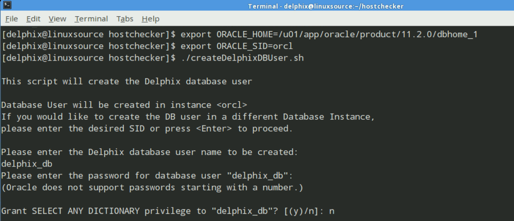

The script should create the user without error.

<br></br>
## <a id="_ex3"></a>Exercise 3 – Validate the Source and Target Environment with Hostchecker

In this exercise, you will:

- Use the hostchecker program to run validation tests on your Linux Source
- Use the hostchecker program to run validation tests on your Linux Target

**Steps to Validate the Source Environment with Hostchecker**

1. Connect to your Linux Source by opening **Terminal** on your Lab Server
   - Type ssh 10.0.x.20 (&#39;x&#39; will be your **Student Number** ).
2. Set the Oracle environment variables below:
   - Type export ORACLE\_HOME=/u01/app/oracle/product/11.2.0/dbhome\_1
   - Type export ORACLE\_SID=orcl
   - Type export PATH=$ORACLE\_HOME/bin:$PATH
3. Ensure you are inside the hostchecker location
   - Type cd /home/delphix/hostchecker
4. Run Hostchecker utility
   - Type ./hostchecker.sh
5. Indicate that this machine is a source
   - Type source
6. Review the available checks that can be run on this system
7. Type 1 and press **Enter**
   - The script will check homedir permissions and return SUCCESS and ALL OK

     

8. Type 3 and press **Enter**
   - Enter an IP address of: 10.0.x.10 (&#39;x&#39; will be your **Student Number** ).
   - Enter the port: 8415
   - The script will test the port and return SUCCESS and ALL OK.
9. Repeat option 3 for the following ports: 8341 and 873
10. Type 5 and press **Enter**
    - Type 5 to select the ORACLE\_HOME associated with the &#39;orcl&#39; database (/u01/app/oracle/product/11.2.0/dbhome\_1), and press **Enter**
    - The script will test the Oracle Home and return SUCCESS and ALL OK
11. Type 6 and press **Enter**
    - Type 3 to select the Oracle Instance associated with the &#39;orcl&#39; database, and press **Enter**
    - Provide the Oracle home path at the prompt: /u01/app/oracle/product/11.2.0/dbhome\_1
    - Enter the username and password of the Oracle database user created in exercise 2 (Username: delphix\_db and Password: delphix\_db or the credentials provided above)
    - The script will test the Oracle Instances and return SUCCESS and ALL OK
12. Type 7 and press **Enter**
    - The script will test the /etc/oratab file and return SUCCESS and ALL OK
13. Type 8 and press **Enter**
    - Enter a password of: delphix
    - The script will test the SSH connectivity to the host and return SUCCESS and ALL OK.
14. Type 9 and press **Enter**
    - The script will return a WARNING due to permissions. This is normal.
15. Type 10 and press **Enter**
    - Enter a password of: delphix
    - The script will test sudo privileges and return SUCCESS and ALL OK
16. Type 11 and press **Enter**
    - Enter a path of: /u01/app/toolkit
    - The script will test the path and return SUCCESS and ALL OK
17. Type quit to exit hostchecker.

Were all tests successful? If not, which ones failed and why?

Note: In a production installation, the sshd\_config test will return a WARNING response due to permissions on the file. If hostchecker is run as root, for this test, it will perform the test properly.


**Steps to Validate the Target Environment with Hostchecker**

1. Connect to your Linux Target A by opening **Terminal** on your Lab Server
   - Type ssh 10.0.x.30 (&#39;x&#39; will be your **Student Number** ).
2. Extract the **hostchecker\_linux\_x86.tar** file in your home directory
   - Type ls -ltr
   - Type tar -xvf hostchecker\_linux\_x86.tar
3. Ensure you are inside the hostchecker location
   - Type cd /home/delphix/hostchecker
4. Run Hostchecker utility
   - Type ./hostchecker.sh
5. Indicate that this machine is a target
   - Type target
6. Review the available checks that can be run on this system
7. Type 1 and press **Enter**
   - The script will check homedir permissions and return SUCCESS and ALL OK

     

8. Type 3 and press **Enter**
   - Enter an IP address of: 10.0.x.10 (&#39;x&#39; will be your **Student Number** ).
   - Enter the port: 8415
   - The script will test the port and return SUCCESS and ALL OK.
9. Repeat option 3 for the following ports: 873, 22, 80 and 443
10. Type 5 and press **Enter**
    - Type option 4 select the current ORACLE\_HOME value, and press **Enter**
    - The script will test the Oracle Home and return SUCCESS and ALL OK
11. Type 6 and press **Enter**
    - The script will test the /etc/oratab file and return SUCCESS and ALL OK
12. Type 7 and press **Enter**
    - Enter a password of: delphix
    - The script will test the SSH connectivity to the host and return SUCCESS and ALL OK.
13. Type 8 and press **Enter**
    - The script will return WARNING due to permissions. This is normal.
14. Type 9 and press **Enter**
    - Enter a password of: delphix
    - The script will test sudo privileges and return SUCCESS and ALL OK
15. Type 10 and press **Enter**
    - Enter a path of: /u01/app/toolkit
    - The script will test the path and return SUCCESS and ALL OK
16. Type quit to exit **hostchecker**.

If you have completed all of the checks and they have returned SUCCESS and ALL OK, you have completed this exercise.

Note: In a production installation, the sshd\_config test will return a WARNING response, due to permissions on the file. If hostchecker is run as root, for this test, it will perform the test properly.

<br></br>
## <a id="_ex4"></a>Exercise 4 – Add a Source Environment

In this exercise, you will:

- Connect Delphix to your Source Oracle Database server
- Create a Source Environment

**Context**

Before users can create their own virtual databases, Delphix needs to connect to source data. In Delphix, an environment is a host that runs database software. For example, a Linux system running Oracle. the environment is where the Delphix engine will search for available data sources. Credentials to access the host need to be provided while configuring an environment.

**Steps**

1. Log into the Delphix Data Platform UI as the ***admin*** user and the password that was set during the Engine setup.
   - Note: If you forgot your admin password, please ask your lab administrator to reset it.
2. Click the **Manage** menu and select **Environments** from the list
3. Click the ellipses ( **…** ) next to **Environments** then choose **Add Environment**
4. On the Host and Server select the following:
   - Host OS: **Unix/Linux**
   - Server Type: **Standalone**

     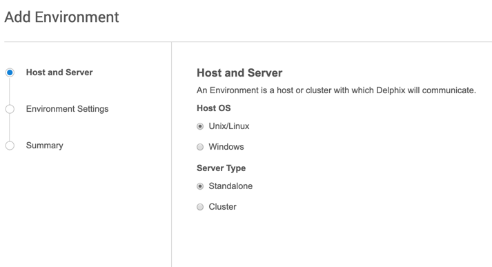

5. For Environment Settings, provide the following information
   - Environment Name: Source
   - Host Address: ***10.0.x.20*** (&#39;x&#39; will be your **Student Number** )
   - NFS Addresses: ***10.0.x.20*** (&#39;x&#39; will be your **Student Number** )
   - Leave the **DSP** fields blank
   - Set **Login Type** to **Username and Password**
   - OS Username: ***delphix***
   - OS Password: ***Delphix*** (Note: Enter the Toolkit Path before Validating the Username and Password)
   - Toolkit Path: /u01/app/toolkit
   - Click **Validate**

     

6. Click **Next**
7. Click **Submit**
8. You can view the status of the environment creation and discovery by clicking on the **Actions** menu on the top right-hand side of the page. Clicking on the jobs lower right corner, in the Actions pane, will allow you to track its progress

   

<br></br>
## <a id="_ex5"></a>Exercise 5 – Link a dSource

In this exercise, you will:

- Create an Oracle dSource by syncing with your Source Oracle Database
- Create a Delphix Group to hold your dSource object

**Context**

With an environment set-up, users can then sync databases into Delphix. The Delphix engine will read the source database and create a dSource (a custom object). The dSource is not a functional image of the database but a storage-efficient object from which virtual databases can be created. When creating a dSource, Delphix will pull over the complete data set using standard database protocols. Subsequent sync operations, as governed by user-defined policies, will pull only incremental changes. At the end of each sync operation, a snapshot is created that serves as the base point for provisioning operations. These sync operations are called SnapSync. Additional details on sync functionality can be found [here](https://docs.delphix.com/docs/datasets/getting-started/managing-data-sources-and-syncing-data).

**Steps**

1. View the Environment details
   - Click on the **Environment** on the left on review information on the **Details** tab

     

2. Click on the **Databases** tab to view any discovered database installations and databases

   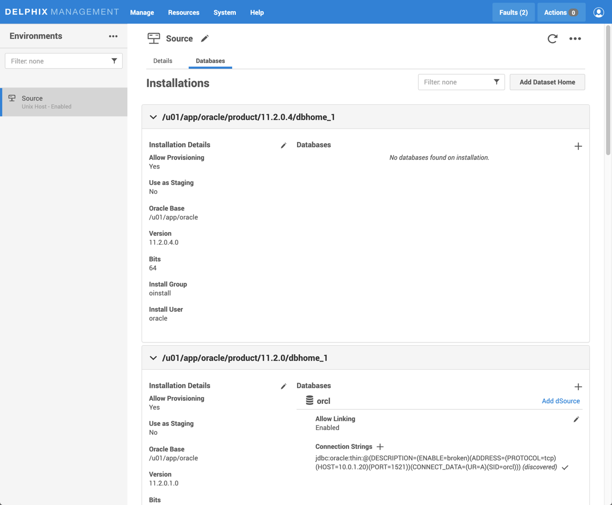

3. Link the **orcl** database
   - On the top menu, click the **Manage** menu and then **Datasets**
   - Click the **+** next to **Datasets** on the top left portion of your screen and then select **Add dSource**

     

4. The Welcome page for the dSource Wizard will be displayed. Review the instructions to get an overview of the process and click **Next**
5. In the Source tab select the orcl Data source and provide the username and password of the database user
6. Under the **dSource Configuration** tab we will provide a user-friendly name for the dSource and create a new Dataset Group to place it in.
   - Enter ***orcl*** for the **dSource Name**
   - Click on the **Add Dataset Group** link and enter ***Source DB*** in the **Name** field.

     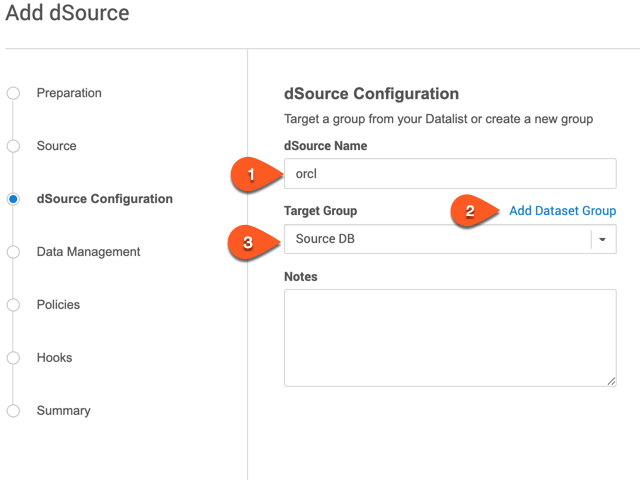

7. Click **Next**
8. On the **Data Management** tab accept the defaults
   - Initial Load: **Immediately**
   - LogSync: **Enable Archive + Online Redo**
   - Click **Next**

9. Accept the Default SnapSync and Retention policy setting
10. Click **Next**
11. Accept defaults for the Hooks. No Hooks will be used.
12. Click **Next**
13. Review the Summary and click **Submit**.

    

14. Wait for the dSource to be created

    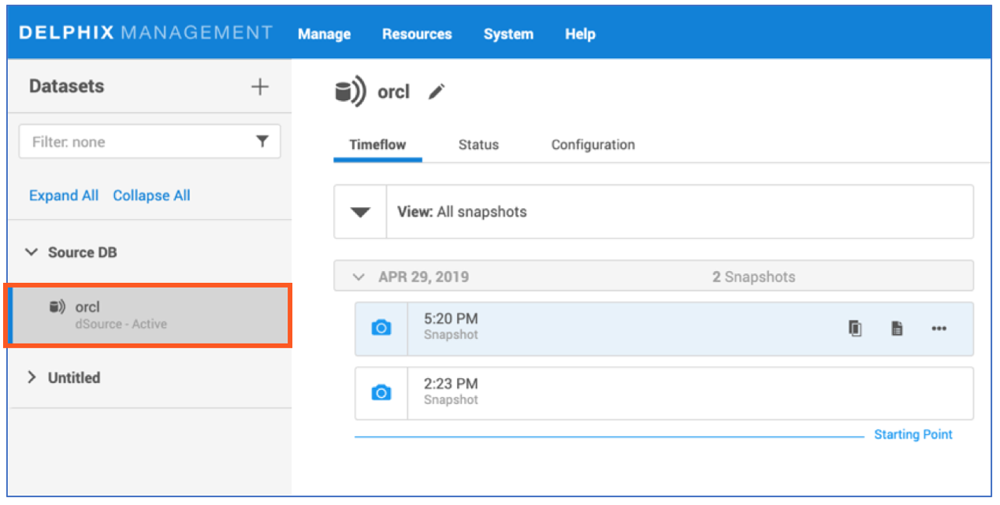

You will know this is successful if the dSource completes in the **Actions** pane without Errors. Click on **Actions** in the top menu bar if you don&#39;t see this pane. Also, the **dSource** state will change to **Active**

<br></br>
## <a id="_ex6"></a>Exercise 6 – Add Target Environments

In this exercise, you will:

- Connect Delphix to your Target Oracle server

**Context**

The target environment is the host where the virtual databases will be created.

**Steps**

1. Log into the Delphix Data Platform UI as the ***admin*** user and the password that was set during the Engine setup (_Note: If you forgot your admin password, please ask your lab administrator to reset it_)
2. In the top menu bar, click **Manage** and then **Environments**.
3. Click the ellipses ( **…** ) next to **Environments** then choose **Add Environment**.
4. Provide the following details in the **Add Environment Wizard**
   - Host OS: **Unix/Linux**
   - Server Type: **Standalone**
   - Click **Next**
5. On the **Environment Settings** tab, enter the following details
   - Environment Name: ***Target***
   - Host Address: ***10.0.x.30*** (&#39;x&#39; will be your **Student Number** )
   - NFS Addresses: ***10.0.x.30*** (&#39;x&#39; will be your **Student Number** )
   - Leave the **DSP** fields blank
   - OS Username: ***delphix***
   - OS Password: ***delphix***
   - Toolkit Path: ***/u01/app/toolkit*** (The Toolkit Path must be entered prior to clicking Validate)
   - Click **Validate**
6. Click **Next**

    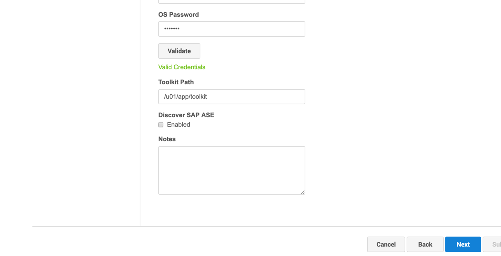

7. Click **Submit**
8. You can view the status of the environment creation and discovery by clicking on the **Actions** menu on the top right-hand side of the page. Clicking on the job in the **Actions** pane will allow you to track its progress.
9. View the Environment details
   - Click on the **Environment Name** ( **Target** ) on the left and review information on the **Details** tab
   - Click on the **Databases** tab to view any discovered database installations and databases

<br></br>
## <a id="_ex7"></a>Exercise 7 – Provision a VDB

In this exercise, you will:

- Create a VDB called devdb

**Context**

The objective of Delphix virtualization is to provide easy access to virtualized databases that resemble production and other data systems. In Exercise 7, we provision a Virtual Database (VDB). VDBs are fully functional database images that can be created from dSources.
**Steps**

1. Click the **Manage** menu and then **Datasets**
2. Expand the **Source DB** group and click the **orcl** dSource from the **Datasets** panel on the left. This will reveal the **Timeflow** for the dSource by default.
3. On the **Timeflow** tab of the dSource select the most recent (topmost) **Snapshot**. The **Provision VDB** iconwill appear along with the **Open LogSync** icon to the right.
4. Click on the **Provision VDB** icon to open the **Provision VDB** wizard. The first of the three icons next to the snapshot time.

   

5. On the **Target Environment** tab click **Target** from the list of Environments
6. On the **Target Environment** tab, use the following information
   - Verify that the **Installation Home** is set to **/u01/app/oracle/product/11.2.0/dbhome\_1 (11.2.0.1.0)**
   - Ensure that the Environment **User** is set to **delphix**
   - Click **Next**

     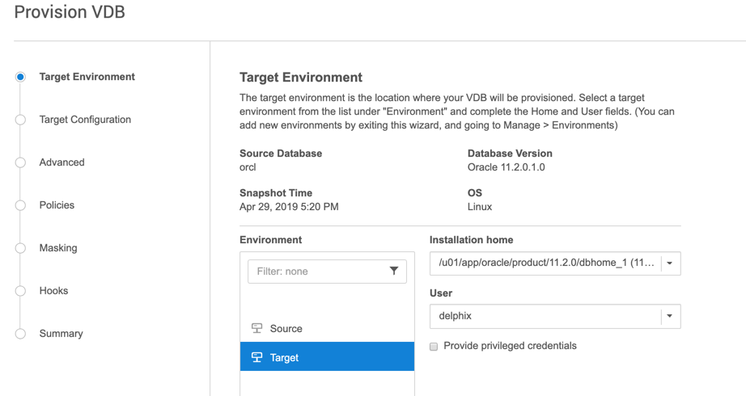

7. Enter the details below on the **Target Configuration** tab , we will provide a user-friendly name for the VDB as well as assign it to a new group.
   - Click **Add Dataset Group**
     - Type ***DB Targets*** for the **Group Name**
     - Click **Add**
   - Verify that **DB Targets** is selected as the **Target Group**
   - **Mount Base** : Type ***/mnt/provision***
   - **Oracle Database Name** : Type ***devdb***
   - **VDB Name** : Type ***devdb***
   - **Oracle Database Unique Name** : Type ***devdb***
   - **Oracle SID** : ***devdb***
   - Click **Next**

     

8. On the **Advanced** tab
   - Confirm that **Open Database After Provision** is selected
   - Confirm that **Enable Archivelog Mode** is selected
   - Check the box next to **Enabled** for **Auto VDB Restart**
   - Click **Next**

     

9. On the **Policies** tab, accept the defaults and click **Next**
10. On the **Masking** tab, confirm that **Mask this VDB** is not checked
11. Accept the defaults on the **Hooks** tab and click **Next**
12. Verify the summary information
13. Click **Submit** tocomplete the VDB creation

    

It may take a couple minutes for the VDB creation to complete. You can monitor the status on the left-hand side of the screen next to the **devdb** object in the **DB Targets** group. On the **Actions** pane on the right-hand side of the screen, you should see the **Provision virtual database &quot;devdb&quot;** item move to the **Recently completed** pane without error. **devdb**&#39;s status will be set to **VDB - Running**.

   

Once the VDB is created, you can verify that the VDB is operational by:

14. Using **Terminal** on your lab server, use SSH to connect to your **Linux Target** server
    - Type ssh 10.0.x.30 (&#39;x&#39; will be your **Student Number** ).
15. Enter the username: delphix
16. Enter the password: delphix
17. Run the following commands on the **target** server command line:
    - Type export ORACLE\_HOME=/u01/app/oracle/product/11.2.0/dbhome\_1
    - Type export ORACLE\_SID=devdb
    - Type export PATH=$ORACLE\_HOME/bin:$PATH
    - Type sqlplus / as sysdba
    - Type select name from v$database;

      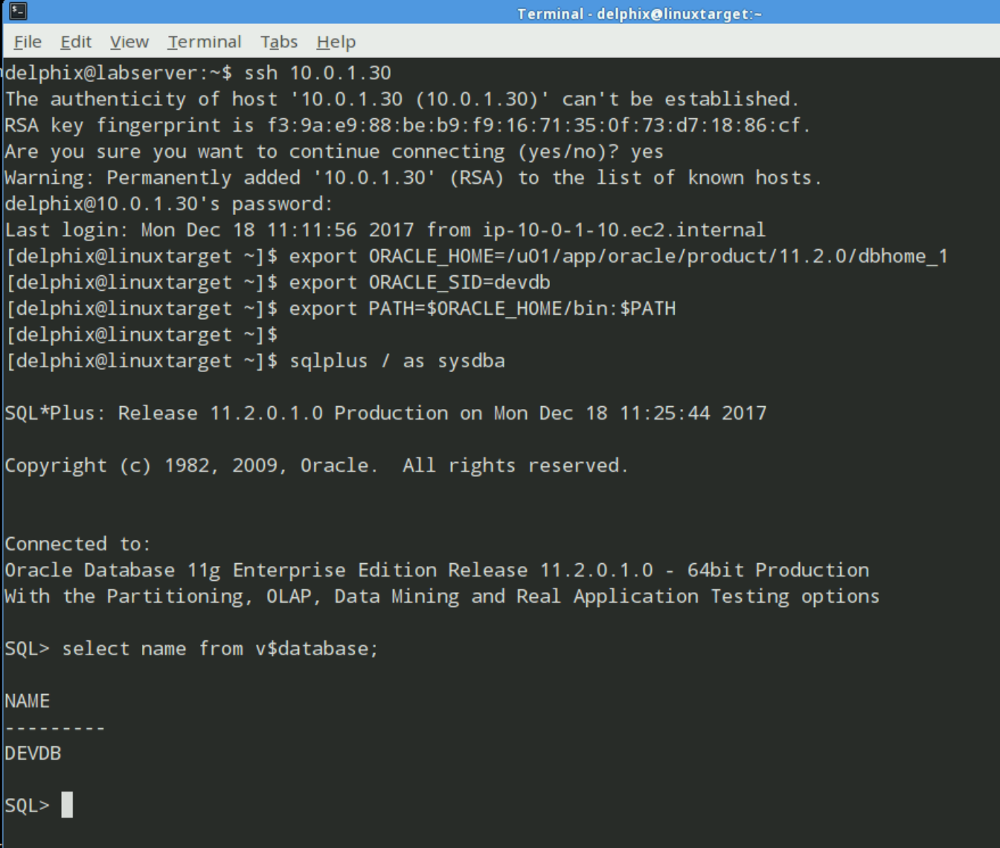

18. Type quit to exit

<br></br>
## <a id="_ex8"></a>Exercise 8 – Refresh a VDB

In this exercise, you will:

- Create a new table on your source database
- Snapshot the dSource
- Refresh your VDB - devdb
- Verify the new table appears on the VDB

**Context**

VDBs can get out of sync as new data comes into the source system. Refreshing a VDB will re-provision it from the dSource. Refreshing a VDB will delete any changes that have been made to it over time.

**Steps**

1. Open **Terminal** on your Lab Server desktop
   - Type ssh delphix@10.0.x.20 (&#39;x&#39; will be your **Student Number** )
2. Enter the username: delphix
3. Enter the password: delphix
4. Run the following commands:
   - Type export ORACLE\_HOME=/u01/app/oracle/product/11.2.0/dbhome\_1
   - Type export ORACLE\_SID=orcl
   - Type export PATH=$ORACLE\_HOME/bin:$PATH
   - Type sqlplus / as sysdba
   - Type create table sourcetab as select \* from dba\_objects;
5. Go back to the **Delphix Data Platform** in your browser (click the **Delphix** logo to go back to the main screen if required)
6. Click on the **orcl** dSource object on the left side of your screen (expand **DB Source** group if needed)
7. Click the **Camera** Icon on the top-right to take a snapshot
8. Click on the **devdb** VDB on the left side of your screen
9. Click the **Timeflow** tab
10. Click the **Refresh** button on the top right next to the **snapshot** icon.

    

11. There are two options for refreshing the VDB, choose the **Faster** option to refresh from the most recent snapshot from the **orcl** dSource
12. Click **Next**
13. Click **Submit**

    

    - Once the refresh has completed, a new VDB snapshot will be generated and reflected in the **Timeflow**.

    

    - Log into **devdb** to confirm.

14. Open **Terminal** on your Lab Server desktop
    - Type ssh delphix@10.0.x.30 (&#39;x&#39; will be your **Student Number** )
15. Enter the username: delphix
16. Enter the password: delphix
17. Run the following commands:

    - Type export ORACLE\_HOME=/u01/app/oracle/product/11.2.0/dbhome\_1
    - Type export ORACLE\_SID=devdb
    - Type export PATH=$ORACLE\_HOME/bin:$PATH
    - Type sqlplus / as sysdba
    - Type select count(\*) from sourcetab;

      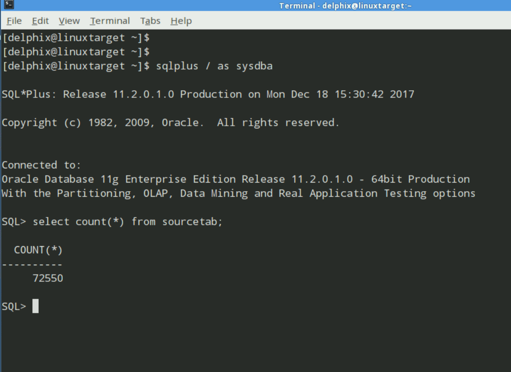

If this returns a count of rows, the snapshot/refresh was successful.

<br></br>
## <a id="_ex9"></a>Exercise 9 – Rewind a VDB

In this exercise, you will:

- Take a snapshot of the devdb VDB
- Corrupt the devdb VDB to introduce a bootstrap error
- Rewind the devdb VDB to recover from the error

**Context**

Rewinding a VDB rolls it back to a previous point in its Timeflow and re-provisions the VDB. The VDB will no longer contain changes after the rewind point. it can be triggered when changes to the VDB do not need to be saved.

**Steps**

1. On the Delphix main screen, select the **devdb** VDB
2. Click the **Camera icon** on the top right to take a snapshot of the VDB

   

3. A new snapshot card will be created on the **devdb Timeflow**. Make a note of the date/time for the latest snapshot card.
4. Open Terminal on your Lab Server desktop
   - Type: ssh delphix@10.0.x.30 (&#39;x&#39; will be your **Student Number** )
5. Enter the username: delphix
6. Enter the password: delphix
7. Run the following commands:
   - Type export ORACLE\_SID=devdb
   - Type sqlplus / as sysdba
   - Type delete from sys.obj$;
   - Type commit;
   - Type shutdown abort;
   - Type startup;

     

    - Note that the database is unable to come online due to a bootstrap error. The **devdb** database is now corrupted. Now we will rewind the VDB to the last good snapshot to fix this.

8. In the Delphix Data Platform (web browser), click on the **devdb** VDB if it is not already selected
9. Click on the **Timeflow** tab and select the snapshot associated with the date/time you recorded prior to corrupting your database. This will most likely be the latest snapshot.
10. Hover over the **Snapshot** to reveal the **Rewind** button.
11. Click the **Rewind VDB** button on the **Timeflow**

    

12. Confirm that you wish to rewind the VDB by clicking **Rewind**.

    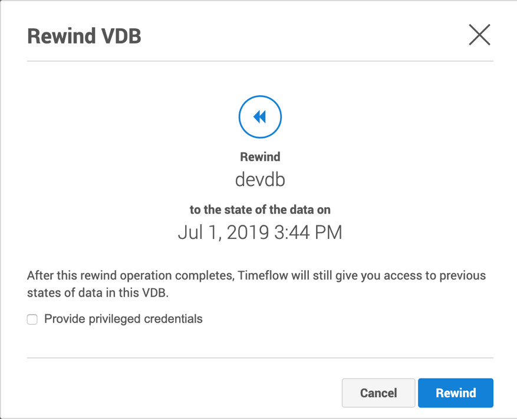

Once the rewind operation is complete, you can confirm the rewind was successful by connecting to the server again and querying the database:

13. Open Terminal on your Lab Server desktop
14. Type ssh delphix@10.0.x.30 (&#39;x&#39; will be your **Student Number** )
15. Enter the username: delphix
16. Enter the password: delphix
17. Run the following commands:
    - Type export ORACLE\_HOME=/u01/app/oracle/product/11.2.0/dbhome\_1
    - Type export ORACLE\_SID=devdb
    - Type export PATH=$ORACLE\_HOME/bin:$PATH
    - Type sqlplus / as sysdba
    - Type select count(\*) from sourcetab;

      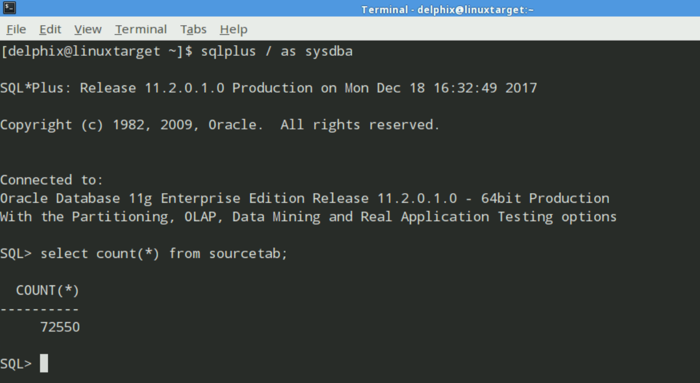

<br></br>
## <a id="_ex10"></a>Exercise 10 – Set a New Retention Policy

There are four types of Policies in Delphix. In this exercise, you will:

- Create a Retention Policy
- Set the new policy to keep snapshots and logs for 30 days, along with 3 monthly snapshots
- Apply the policy to the VDB we created in the previous exercise

**Context**

Both dSources and VDBs timeflow is governed by snapshots, which are either created manually or through policies. Retention policies govern the lifespan of such snapshots and help clean older ones that are no longer relevant.

**Steps**

1. In the top menu bar, click on **Manage** and then **Policies**
2. Click the **Retention** tab, click **+Retention**

   
3. Provide the following details:
   - Policy Name: ***Long Term***
   - Keep Logs for: ***30** ***days**
   - Keep Snapshots for: ***30** ***days**
4. Click the ***Show advanced*** _link_

   

5. Click the checkbox next to **Keep 3 Snapshot(s) on 1st of every month**
6. Click **Next**
7. On the **Datasets** tab click the **checkbox** for the **devdb**
8. Click **Submit**

   

Expand the **policies** menu to validate that the new **Long Term** policy has been applied to the **devdb** VDB.


<br></br>
## <a id="_ex11"></a>Exercise 11 – Create and Save a Hook Operation Template

In this exercise, you will:

- Create a Hook Template called Create APPUSER
- Insert code into the template that will log into a database and add a user named appuser

**Context**

Hook operations allow users to execute custom operations at select points during linking sources and managing virtual datasets.

**Steps**

1. In the top menu bar, click **Manage** , then **Hook Templates**
2. Click the **plus sign** to the right of the word **Templates** in the **Hook Templates Wizard**
3. Provide the _Name_: ***Create APPUSER***
4. Ensure _Type_ is set to: **System Shell Command**
5. Under **Contents** , enter the following code:
   ```
   $ORACLE_HOME/bin/sqlplus / as sysdba << EOF
     create user appuser identified by appuser;
     grant connect, resource to appuser;
     exit;
   EOF
   ```

   **IMPORTANT:** Make sure the carriage returns you see here are the same in the pasted contents.

   

6. Click **Create**
7. Verify the **Create APPUSER** Hook Operation Template is in the list, then click **Close**

   

<br></br>
## <a id="_ex12"></a>Exercise 12 – Create a VDB Template

In this exercise, you will:

- Create a VDB Configuration template called _Small DB Template_
- Set a custom Oracle parameter for this template

**Steps**

1. In the top menu bar, click **Manage** , then **VDB Config Templates**
2. Click the **plus sign** next to the word **VDB Config Templates** and select **New Template** from the drop-down.
3. Name: ***1G Template***
4. Click **Create**

   

5. Click **1G Template** under **VDB Config Templates**
6. Click the **pencil** icon on the top right of the **VDB Configuration Templates** screen
7. Click the **plus sign** on the **top right** to add a new parameter
   - Double-click the row to enter a new value
8. In the row that is now highlighted, enter the following information:
   - Name: ***sga***_**\_**_***max\_size***
   - Value: ***1G***
9. Click the **checkmark** to save the **Template**.

You can verify that this was successful by returning to the **VDB Configuration Templates Wizard** and clicking on the **1G Template** item.

<br></br>
## <a id="_ex13"></a>Exercise 13 – Provision a VDB with Hook and VDB Template

In this exercise, you will:

- Create a VDB called **qadb** onTarget
- Use the VDB Configuration Template we created previously
- Use the Hook Operation Template we created previously
- Log into the VDB
- Verify the VDB Configuration Template and Hook Operation Template were successful

**Steps**

1. Return to the Delphix home screen by clicking the **Delphix** logo on the top left of the screen
2. Click on the **orcl** dSource object in the **Datasets** panel
3. Select the latest **Snapshot** , click the **Provision** button
4. On the left hand side of the **Target Environment** tab, click the **Target Environment Target**
5. Click **Next**
6. On the **Target Configuration** tab, enter the following details:
   - **Select DB Targets** from the **Datasets Group** drop-down list,
   - **Mount Base** : **/mnt/provision** (this should already be filled in)
   - **Database Name** : ***qadb***
   - **Database Unique Name** : ***qadb***
   - **SID** : ***qadb***
   - Click **Configure VDB Parameters** checkbox under **VDB Database Parameters**
   - Click **Next**
7. On the **Advanced** tab, click the **Enabled** checkbox under **Auto VDB Restart**
8. Click **Next**
9. On **the VDB Configure Parameters** tab, click the **1G Template** that we created earlier from the **Select template** drop-down list
10. Click **Next**

    

11. On the **Policies** tab, accept Default Snapshot Policy and Click **Next**
12. On the Masking tab, leave Mask this VDB unchecked. Click **Next**
13. On the **Hooks** tab with **Configure Clone** already selected on the left side of the **Provision VDB Wizard** , click the **plus sign** to the right of the words **Hook Points** and select **Create from Template** from the drop-down list

    

14. **Enter a Name** ***QA APPUSER*** for the **Hook Operation**
15. Click on the **Create APPUSER** template we created earlier
16. Click the **Create** button

    

17. Click Next

    

18. Click **Next**
19. Verify the summary information, and click **Submit**

Note: It may take a couple minutes for the VDB creation to complete. You can monitor the progress on the left-hand side of the screen next to the **qadb** object in the **DB Targets** group. On the **Actions** pane on the right-hand side of the screen, you should see the **Provision virtual database &quot;qadb&quot;** item move to the **Recently completed** pane without error.

Once the VDB is created, you can verify that the VDB is operational by:

20. Using **Terminal** on your lab server, use SSH to connect to your Linux Target server
    - Type ssh 10.0.x.30 (&#39;x&#39; will be your **Student Number** ).
21. Enter the username: delphix
22. Enter the password: delphix
23. Run the following commands:
    - Type export ORACLE\_SID=qadb
    - Type export ORACLE\_HOME=/u01/app/oracle/product/11.2.0/dbhome\_1
    - Type export PATH=$ORACLE\_HOME/bin:$PATH
    - Type sqlplus / as sysdba
    - Type show parameter memory\_target
    - Type connect appuser/appuser

This will verify that the VDB is online with the **VDB Configuration Template** we specified, and that the **APPUSER** user was created by our hook.


Note: It may take a couple minutes for the VDB creation to complete. You can monitor the progress on the left-hand side of the screen next to the **qadb** object in the **DB Targets** group. On the **Actions** pane on the right-hand side of the screen, you should see the **Provision virtual database &quot;qadb&quot;** item move to the **Recently completed** pane without error. Once the VDB is created, you can verify that the VDB is operational by:

<br></br>
## <a id="_ex14"></a>Optional Advanced Exercise – Discover and Link a 12c Container Database dSource

In this exercise, you will:

- Using the createDelphixDBUser script to create the c##delphix\_db user in CDB$Root.
- Using the createDelphixDBUser script to create the delphix\_db user in the PDB WINTERFELL
- Discover the 12C Database to identify pluggable database WINTERFELL
- Add a dSource for the PDB WINTERFELL

**Steps**

We will walk through the steps to get you acquainted with discovering 12C PDB&#39;s and creating a dSource from them.

1. Using the Terminal icon on the Lab desktop connect to the Linux Source Server
   - Type ssh 10.0.x.20 (&#39;x&#39; will be your **Student Number** ).
   - Enter the password delphix
2. Set the appropriate environment variables for the 12c Database and cd to the hostchecker directory :
   - Type export ORACLE\_HOME=/u02/app/oracle/product/12.2.0/dbhome\_1
   - Type export ORACLE\_SID=gotcdb.
   - Type export PATH= $ORACLE\_HOME/bin:$PATH
   - Type cd hostchecker

Note: If the hostchecker directory doesn&#39;t exist, untar the hostchecker\_linux\_x86.tar file (Type tar -xvf hostchecker\_linux\_x86.tar)

3. Run the **createDelphixDBUser** Script to first create the **c##delphix\_db** user in the CDB
   - Type ./createDelphixDBUser.sh
   - Enter the Database Instance enter : gotcdb
   - When prompted to verify if you want to create the user in CDB#ROOT press Enter
   - Enter the DB User name: c##delphix\_db
   - Enter password : delphix
   - When prompted for select any dictionary privileges : n

The script will create the c##delphix\_db user with necessary privileges.

4. Run the **createDelphixDBUser** script again to create the **delphix\_db** user in the PDB **WINTERFELL**
   - ./createDelphixDBUser.sh
   - When Prompted for the Database Instance enter gotcdb
   - When Prompted for pluggable database name enter winterfell
   - When Prompted for the Database User enter delphix\_db
   - When Prompted for the password use : delphix
   - When prompted for select any dictionary privileges : n

The script will now create delphix\_db user in the PDB winterfell with the necessary privileges.

**Discover the CDB**

If not already connected, connect to your Delphix Engine as Delphix Admin.

1. Navigate to Manage -> Environments Page
2. Select the Source Environment and click on the Databases Tab.
3. Scroll down to find the home /u01/app/oracle/product/12.2.0/dbhome\_1
4. Click on Discover CDB to discover the PDB&#39;s in the CDB

   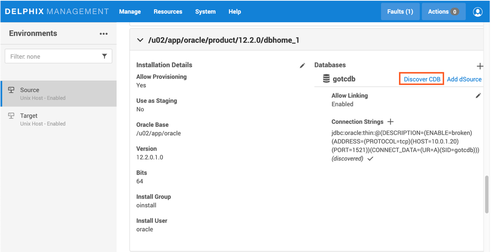

5. On the Discover CDB wizard Popup Enter the following details
   - Username: c##delphix\_db
   - Password: delphix
6. Click on OK
7. Click and monitor the Actions tab to ensure it completes without error.

Once complete, PDB **WINTERFELL** should be discovered and displayed under the 12c home

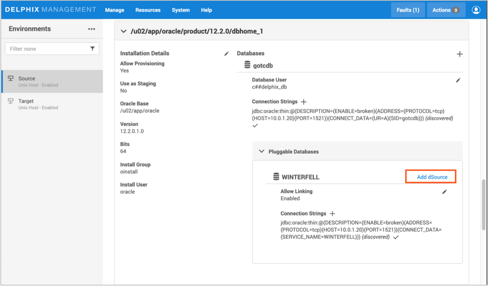

**Link an Oracle 12c dSource**

1. Click on the Add dSource button to add a dSource from this database
2. On the Add dSource Wizard make sure the PDB **WINTERFELL** is selected.
3. Scroll down and add db user details
   - DB Username: delphix\_db
   - DB Password: delphix
4. Click on **Verify credentials** to verify the give details.
5. Click **Next**

   

6. On the dSource Configuration tab of the Add dSource wizard Click on **Add Dataset Group**
7. On the Add Dataset Group pop up, add a new group with the name ***Ora12C Sources***.
8. Click **Add**.
9. Make sure the new dataset group is selected and click **Next**.
10. Review and Accept the defaults on the Data Management tab by clicking **Next**
11. Review the defaults on the Policies tab and click on **Next**.
12. We will not be configuring hooks at this time. Click on **Next**.
13. Review Summary and Click **Submit**.

    

14. Click on Actions on the top right-hand corner if Actions Pane is hidden to monitor progress of the Action and ensure it completes without error.

    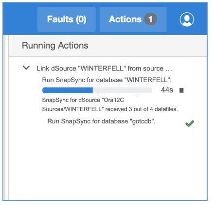

15. Once the dSource creation is completed Navigate to **Manage** -> **Datasets**.
16. Expand the Ora12c Sources group to explore the DB&#39;s under it. You should see both the CDB gotcdb and the PDB WINTERFELL listed under it.
    - Note the Different icons used to represent CDB and PDB&#39;s
    - Also note there is no timeflow available for the container database gotcdb.

    

17. Click on the PDB WINTERFELL to see the **Timeflow** , **Status** and **Configurations** under the respective tabs.

    

<br></br>
## <a id="_ex15"></a>Optional Advanced Exercise – Provision a Virtual PDB (vPDB)

In this exercise you will:

- Provision a VPDB from a 12c dSource.

**Steps**

As an advanced exercise, this lab has no corresponding Lab Solution. Instead, we will walk through the steps to get you acquainted with provisioning a PDB from a 12c dSource.

1. Login to the Delphix Engine if not already logged in.
2. Navigate to **Manage** -> **Datasets**
3. Expand **Ora12C Sources** Group and click on WINTERFELL PDB
4. Hover on the latest snapshot card and click on **Provision a VDB**.

   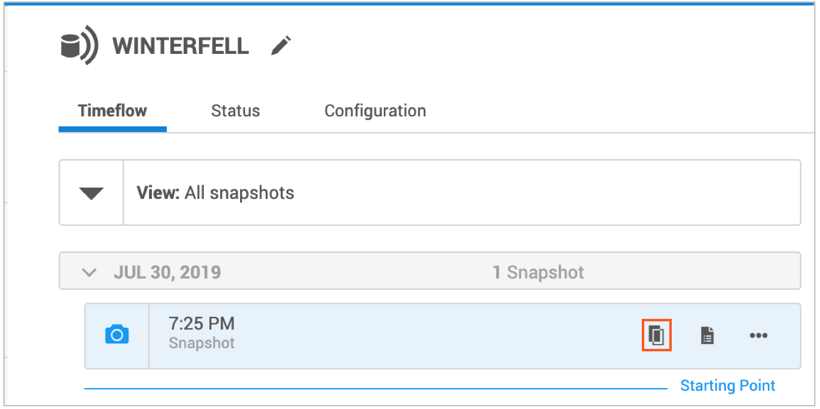

5. On the Provision vPDB Wizard
   - Click on **Target** under **Environments**.
   - And click the check box for **Create a New Container Database**.
   - Click **Next**.
6. On the Target Configuration tab click **Add Dataset Group**
7. On the Add Dataset Group Wizard create a new group with the name ***Ora12C Targets***.
8. Click **Add**
9. Back on the **Target Configuration** page make sure the new Dataset group **Ora12C Targets** is selected.
10. Add the following details. (Database Name and SID limited to 8 characters).
    - Pluggable Database Name : devPDB
    - vPDB Name : devPDB
    - Database Name: VCWINTER
    - vCDB Name : VCWINTER
    - Database Unique Name: VCWINTER
    - SID: VCWINTER
11. Click **Next**.

    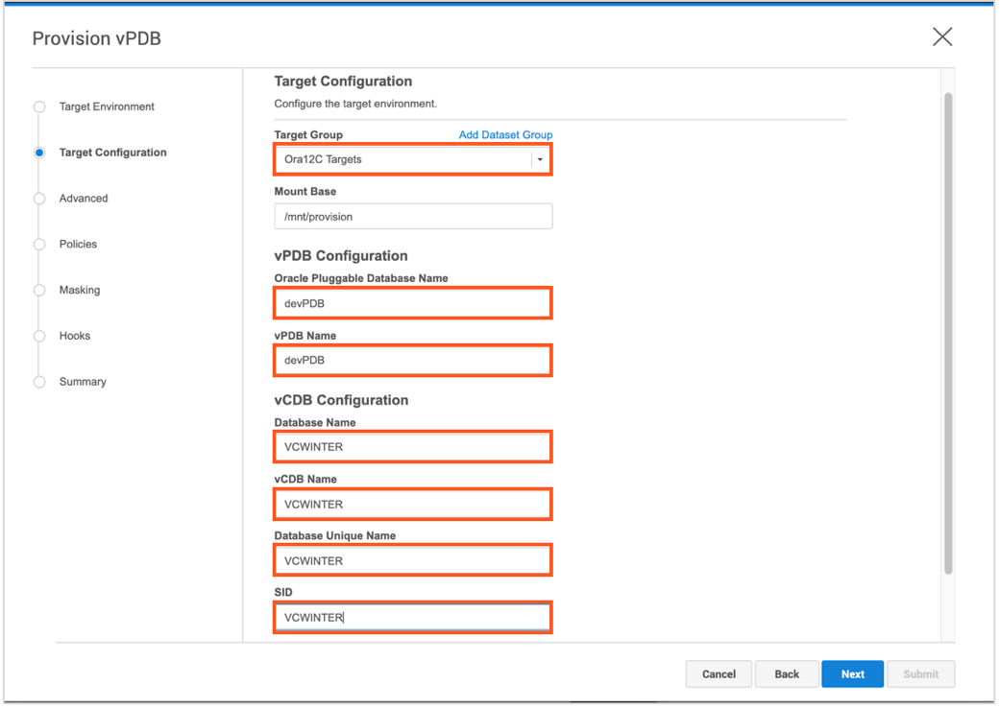

12. On the **Advanced** page click the **Auto vCDB Restart Enabled checkbox**
13. Click **Next**
14. Accept the Default policies. Click **Next**
15. We will not be configuring hooks now. Click **Next**.
16. Review the summary page and click **Submit**.

Note: Once Submitted, the Action will show a working screen for a few seconds. You can choose to let the Action run in the background.

17. Monitor the Actions Pane by clicking on the Actions button on the top right-hand corner. You can get more details about the action by clicking on the >, to the left of the currently running action, to expand it.

    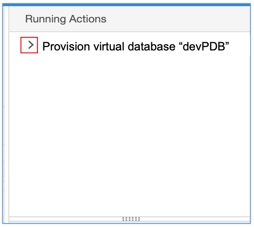

Note: Once Action is completed you can see the vCDB we added and the VPDB just provisioned listed under the new Dataset group Ora12C Targets. Expand the group if necessary, to view the objects under it. Note that there is no timeflow for the vCDB.

18. Click on devPDB and review Timeflow, Status and configuration details under the respective tabs.

    

19. Using the **Terminal** icon on your lab desktop connect to the **target** server. (Refer to the Important IP Addresses section of the labguide)
    - Click on the **Terminal** icon on the lab desktop
    - Type ssh 10.0.x.30 (replace # with the student number assigned to you).
20. Set up the environment variables for 12C
    - Type export ORACLE\_SID=VCWINTER
    - Type export ORACLE\_HOME=/u02/app/oracle/product/12.2.0/dbhome\_1
    - Type export PATH=$ORACLE\_HOME/bin:$PATH
21. Connect to sqlplus and verify the CDB and PDB details
    - Type sqlplus / as sysdba
22. At the SQL> prompt type
    - select name from v$database;
    - alter session set container=DEVPDB;
    - show CON\_NAME

<br></br>
## <a id="_ex16"></a>Optional Advanced Exercise – Measure Network Performance Test through the CLI

In this exercise, you will:

- Log into the Delphix Data Platform CLI as admin
- Perform a network latency test to Target
- Perform a network throughput test to Target

**Steps**

As an advanced exercise, this lab has no corresponding Lab Solution. Instead, we will walk through the steps to get you acquainted the Delphix CLI for admin.

1. On your Lab Server desktop, double-click on **Terminal**
2. Type: ssh admin@10.0.x.10 (&#39;x&#39; is your **Student Number** assigned by your instructor)
   - If you receive a prompt asking you if you are sure you want to connect, enter: Yes
   - Enter the password: delphix
   - You are now at the root of the Delphix CLI as a Delphix Administrator
3. Create a network latency test by typing: network test latency create
   - List the default/required parameters by typing: get
   - Set the remoteHost value to the TargetA environment IP address: set remoteHost=10.0.x.30 (&#39;x&#39; will be your **Student Number** )
   - Begin the test by typing: commit

     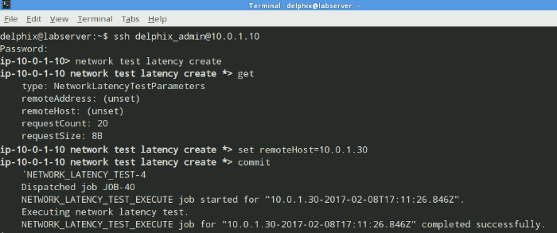

4. View the results of the latency test:
   - Get to the latency test section again by typing: network test latency
   - List the completed tests by typing: ls
   - Type select followed by the name of the test from the list. For example:
   ```select 10.0.1.30-2015-09-18T12:47:19.711Z```
   - View the results of the test by typing: get

     

5. Create a network throughput test
   - While still logged into the CLI, return to the root by typing: cd /
   - Begin a network throughput test by typing: network test throughput create
   - List the default/required parameters by typing: get
   - Set the remoteHost value to the TargetA environment IP address: setremoteHost=10.0.x.30 (&#39;x&#39; will be your **Student Number** )
   - Begin the test by typing: commit

     

6. View the results of the throughput test:
   - Get to the throughput test section again by typing: network test throughput
   - List the completed tests by typing: ls
   - Type select followed by the name of the test from the list. For example:
   ```select 10.0.1.30-2015-09-18T13:13:08.152Z```
   - View the results of the test by typing: get

     

<br></br>
## <a id="_ex17"></a>Optional Advanced Exercise – Configure Delphix Replication

Note: This exercise is only possible if your classroom has been configured with 2 or more students.

In this exercise, you will:

- Set up a replication profile
- Replicate your entire Delphix Data Platform to another Delphix Data Platform
- View the replicas in the target Delphix Data Platform

**Steps**

As an advanced exercise, this lab has no corresponding Lab Solution. Instead, we will walk through the steps to get you acquainted the Delphix Replication capability.

1. In the Delphix GUI, select **System** and then **Replication** on the top menu bar
2. Add a **Replication Profile** called DR Replica
   - Click the **plus sign** next to **Replication Profiles** on the top left
   - Enter a **Replica Profile Name** : ***DR Replica***
   - For Target Engine, enter the **Delphix Data Platform IP address** for the next student in your classroom environment. If you are the last student, use the Delphix Data Platform IP address for Student 1. For example, in a class with 3 students:
     - Student 1 Delphix Data Platform is at 10.0.1.10, and they will replicate to 10.0.2.10
     - Student 2 Delphix Data Platform is at 10.0.2.10, and they will replicate to 10.0.3.10
     - Student 3 Delphix Data Platform is at 10.0.3.10, and they will replicate to 10.0.1.10
     - Ask your instructor if you have any questions or confusion about this configuration.
   - Enter the User Name: ***admin***
   - Enter the Password: ***delphix***
   - Do not enable Automatic Replication or configure Traffic Options
   - For the Objects Being Replicated, select: **Entire Delphix Data Platform**
   - Click **Create** at the bottom when ready.

   

3. Start the Replication by clicking the **Replicate Now** button on the top right of your screen.
4. Click **Replicate** to confirm you are ready to begin.
5. Once the initial full replication is complete, you will see a message stating **Last Replication Successful**.

   

6. Check the results on your target Delphix Data Platform
   - In your lab server browser, enter ***the IP address*** you used for the Target Engine in your replica profile. For example, if you are Student 1, your Delphix Data Platform is at 10.0.1.10, and your target would have been 10.0.2.10.
   - Log in as user ***admin*** with the password ***delphix***
   - Observe the dropdown list under **Datasets** on the top left corner of your screen. It should have **Default shown** which is the default **Namespace** for Delphix replica targets.
   - In order to see the replica objects, click on the dropdown list and select the second entry, which should reflect the hostname of the source Delphix Data Platform that sent the replica.

_Note: The hostname shown in the labs is based on the default hostname given to the Delphix Data Platform in Amazon AWS, consisting of the prefix &quot;ip&quot; followed by the IP address separated by hyphens._

7. While still logged into your target Delphix Data Platform, click on **System** and then **Replication**
8. Observe the **Received Replicas** section at the bottom, indicating and verifying the target&#39;s receipt of replication data.
   - Note: The **Failover Now** option will not work for these labs due to namespace collisions. This is an inherent outcome to plan for when using Active/Active replication.

© 2015 Delphix Corp. All rights reserved

